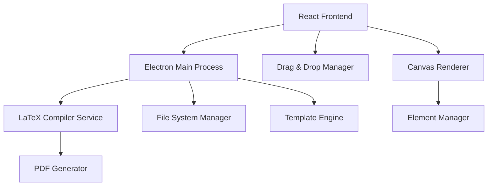

# Design Document

## Overview

The LaTeX Presentation Editor is a desktop application built using Electron with a React frontend and Node.js backend. The application provides a WYSIWYG interface for creating presentations while generating LaTeX/Beamer code behind the scenes. The architecture separates the visual editing layer from the LaTeX generation layer, enabling real-time preview and instant PDF compilation.

## Architecture

### High-Level Architecture



### Technology Stack

- **Frontend**: React 18 with TypeScript, Fabric.js for canvas manipulation
- **Desktop Framework**: Electron for cross-platform desktop application
- **Backend**: Node.js with Express for internal API services
- **LaTeX Engine**: TeX Live with latexmk with pdflatex for compilation
- **State Management**: Redux Toolkit for application state
- **Styling**: Tailwind CSS with custom components
- **File Handling**: Node.js fs module with custom serialization

## Components and Interfaces

### Core Components

#### 1. Presentation Manager
- **Purpose**: Manages presentation state, slides, and metadata
- **Key Methods**:
  - `createPresentation()`: Initialize new presentation
  - `addSlide(template?)`: Add slide with optional template
  - `deleteSlide(id)`: Remove slide and update navigation
  - `reorderSlides(fromIndex, toIndex)`: Handle slide reordering

#### 2. Canvas Editor
- **Purpose**: Provides the main editing interface using Fabric.js
- **Key Methods**:
  - `addElement(type, position)`: Add text, image, or shape
  - `selectElement(id)`: Handle element selection
  - `updateElement(id, properties)`: Modify element properties
  - `handleDragDrop(event)`: Process drag and drop operations

#### 3. LaTeX Generator
- **Purpose**: Converts visual elements to LaTeX/Beamer code
- **Key Methods**:
  - `generateSlideCode(slide)`: Convert slide to LaTeX
  - `generatePresentationCode(presentation)`: Full document generation
  - `optimizeCode()`: Clean and optimize LaTeX output
  - `validateSyntax()`: Check LaTeX syntax before compilation

#### 4. Compiler Service
- **Purpose**: Handles LaTeX compilation and PDF generation
- **Key Methods**:
  - `compileLatex(source)`: Compile LaTeX to PDF
  - `watchChanges()`: Monitor for changes and recompile
  - `handleErrors(errors)`: Process compilation errors
  - `cacheResults()`: Cache compiled outputs for performance

#### 5. Element Factory
- **Purpose**: Creates and manages different types of slide elements
- **Supported Elements**:
  - TextBox: Rich text with LaTeX math support
  - Image: Raster and vector image handling
  - Shape: Basic shapes converted to TikZ
  - Chart: Data visualization elements
  - Table: Structured data presentation

### Data Models

#### Presentation Model
```typescript
interface Presentation {
  id: string;
  title: string;
  slides: Slide[];
  theme: Theme;
  metadata: PresentationMetadata;
  settings: PresentationSettings;
}
```

#### Slide Model
```typescript
interface Slide {
  id: string;
  title: string;
  elements: SlideElement[];
  layout: SlideLayout;
  background: Background;
  notes: string;
}
```

#### Element Model
```typescript
interface SlideElement {
  id: string;
  type: ElementType;
  position: Position;
  size: Size;
  properties: ElementProperties;
  latexCode?: string;
}
```

### LaTeX Integration Strategy

#### Template System
- **Base Template**: Custom Beamer class with modern styling
- **Theme Support**: Color schemes, fonts, and layout variations
- **Custom Commands**: Simplified LaTeX commands for common operations

#### Code Generation Pipeline
1. **Element Serialization**: Convert Fabric.js objects to internal format
2. **LaTeX Translation**: Map visual properties to LaTeX commands
3. **Code Assembly**: Combine elements into complete Beamer slides
4. **Optimization**: Remove redundant code and optimize compilation

#### Real-time Compilation
- **Incremental Updates**: Only recompile changed slides
- **Background Processing**: Non-blocking compilation using worker threads
- **Error Recovery**: Graceful handling of LaTeX errors with user feedback
- **Caching Strategy**: Cache compiled slides for instant switching

## Error Handling

### LaTeX Compilation Errors
- **Syntax Errors**: Highlight problematic elements in the UI
- **Missing Packages**: Auto-install common packages or provide guidance
- **Resource Errors**: Handle missing images or fonts gracefully
- **Timeout Handling**: Cancel long-running compilations

### Application Errors
- **File System Errors**: Handle permission issues and disk space
- **Memory Management**: Prevent memory leaks in long editing sessions
- **Crash Recovery**: Auto-save and restore functionality
- **Network Issues**: Handle template downloads and updates

### User Experience
- **Progressive Loading**: Show compilation progress to users
- **Fallback Rendering**: Display last known good state during errors
- **Error Messages**: Clear, actionable error descriptions
- **Recovery Options**: Undo/redo functionality for error recovery

## Testing Strategy

### Unit Testing
- **Component Testing**: React components with Jest and React Testing Library
- **LaTeX Generation**: Test code generation with known inputs/outputs
- **Utility Functions**: Test helper functions and data transformations
- **State Management**: Test Redux reducers and actions

### Integration Testing
- **LaTeX Compilation**: End-to-end compilation testing
- **File Operations**: Test save/load functionality
- **Drag & Drop**: Test interaction workflows
- **Template System**: Test theme application and customization

### Performance Testing
- **Compilation Speed**: Measure LaTeX compilation times
- **Memory Usage**: Monitor memory consumption during editing
- **UI Responsiveness**: Test with large presentations
- **Startup Time**: Optimize application launch performance

### User Acceptance Testing
- **Workflow Testing**: Test complete presentation creation workflows
- **Cross-platform**: Test on Windows, macOS, and Linux
- **Accessibility**: Ensure keyboard navigation and screen reader support
- **Export Quality**: Verify PDF output quality and compatibility

## Security Considerations

### LaTeX Security
- **Command Restriction**: Disable dangerous LaTeX commands
- **File Access**: Restrict file system access from LaTeX
- **Resource Limits**: Prevent infinite loops and excessive resource usage
- **Input Sanitization**: Validate user input before LaTeX generation

### Application Security
- **File Validation**: Validate imported files and templates
- **Update Mechanism**: Secure application updates
- **User Data**: Protect presentation files and user preferences
- **External Resources**: Secure handling of images and external content